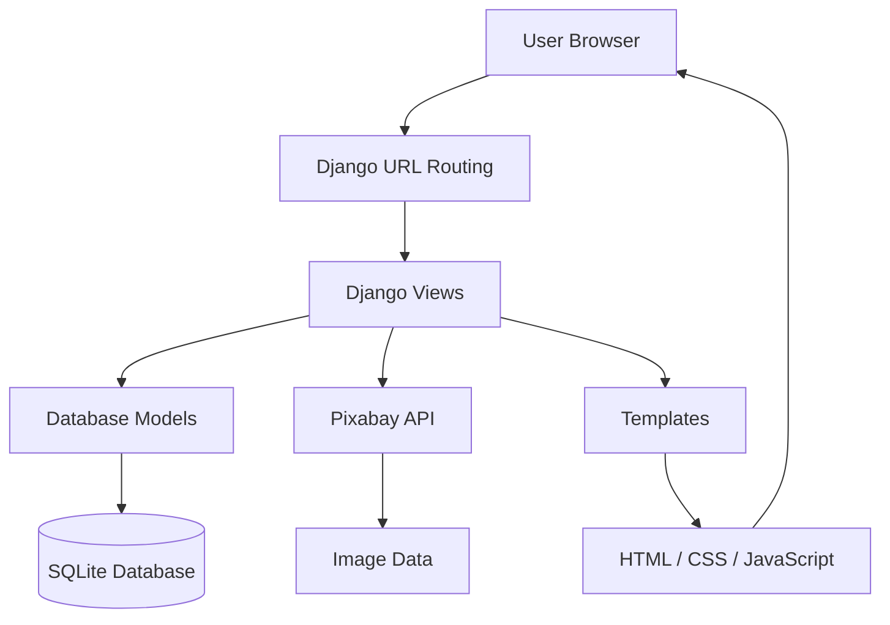

# 💇🏾‍♀️ Hair Salon Booking Website

## Introduction
This project is a Hair Salon Booking Website built with **Django** that allows users to browse hairstyle services and schedule salon appointments online through an interactive interface.

The website demonstrates how Django can be used to build a structured web application that integrates backend logic with front-end design. Python is used to handle the backend functionality, while HTML, CSS, and JavaScript are used to create the front-end interface and user experience. It simulates how a real salon website might allow customers to explore services and schedule appointments.

In addition to appointment management, the application includes an inspiration gallery powered by the Pixabay API. This feature allows users to search for hairstyle inspiration images dynamically and browse results through pagination.


This project was developed as part of the **Tech Academy Software Development Bootcamp: Python Capstone Project** and demonstrates full-stack web development concepts, including:
- database modeling
- form handling
- API integration
- dynamic content rendering
- application structure
- user interaction
- service management
---

## Architecture Overview

The application follows a typical Django web application architecture where user requests are handled by Django views, which interact with the database models and external APIs before rendering templates for the user interface.


---

## ✨ Feature Highlights
The Hair Salon Booking Website includes the following features:
✔ Hairstyle images and descriptions 
✔ Hairstyle details page 
✔ Appointment booking form  
✔ Edit and cancel appointment functionality   
✔ Searchable hairstyle inspiration gallery  
✔ Pixabay API integration for hairstyle images  
✔ Pagination and lazy loading for gallery results  
✔ Django ModelForms for booking and validation  
✔ Clean and Responsive user interface
✔ Organized Django project structure 

### Core Functionality
- Users can browse available hairstyle services
- Each hairstyle includes price, description, and estimated duration
- Users can book appointments through an online form
- Appointments are stored in the database
- Users can edit or cancel existing appointments
- A searchable gallery allows users to discover hairstyle inspiration images from the Pixabay API

  
### Hairstyles Available
Example services available on the website include:
- Boho Braids
- Butterfly Locs
- Knotless Braids
- Mini Twists
- Senegalese Twists
- Silk Press
These services allow users to explore hairstyle options and select the one they would like to book.

---

## 🛠 Technologies Used

### Backend
- Python
- Django

### Frontend
- HTML
- CSS
- JavaScript

### Development Tools
- Git
- GitHub
- Visual Studio Code

---

## 📂 Project Structure
```text
Python-Capstone/
│
├── manage.py
├── requirements.txt
│
├── AppBuilder9000/
│   ├── settings.py
│   ├── urls.py
│   ├── views.py
│   ├── models.py
│   └── admin.py
│
├── templates/
│
├── static/
│   ├── css/
│   ├── images/
│   └── javascript/
│
└── db.sqlite3
```


This structure follows the standard **Django project layout**, separating application logic, templates, and static files.

---
# Getting Started
This section explains how to download and run the project on your own system.

## ⚙️ Installation Process

### 1️⃣ Clone the Repository
```bash
git clone https://github.com/KirstenO09/Python-Capstone.git
```
### 2️⃣ Navigate to the Project Folder
```bash
cd Python-Capstone
```
### 3️⃣ Install Dependencies
```bash
pip install -r requirements.txt
```
### 4️⃣Create an environment variable for the Pixabay API key:
```env
PIXABAY_API_KEY=your_api_key_here
```
### 5️⃣  Run Migrations
```bash
python manage.py migrate
```
### 6️⃣Start the Development Server
```bash
python manage.py runserver
```
### 7️⃣Open the Website
Go to:
```
http://127.0.0.1:8000/
```

---
## 🧪 Build and Test
Testing involves verifying:
- pages load correctly
- hairstyle images display
- booking form submits successfully
- Django routing functions correctly

## Database Design

The application uses Django models to manage salon services and appointments.

### Hairstyle Model
Stores information about salon services including:

- Hairstyle name
- Description
- Service duration
- Price
- Image URL
- Availability status

### Appointment Model
Stores booking information including:
- Customer name
- Customer email
- Selected hairstyle
- Appointment date
- Appointment time
- Special notes
Each appointment is linked to a hairstyle using a **ForeignKey relationship**, ensuring service details such as price and duration are derived directly from the selected hairstyle.
---
## 📸 Screenshots

---
## Contribute
Contributions are welcome to improve the project.

### Possible improvements include:
- User authentication system
- Appointment scheduling calendar
- Admin dashboard for managing bookings
- Email confirmation for appointments
- Online payment integration
- Enhanced UI/UX design

### To contribute:
- Fork the repository
- Create a new branch
- Make your changes
- Submit a pull request

---
## 👩🏾‍💻 Author
***Kirsten Osborne***
**Tech Academy Python Capstone Project**
